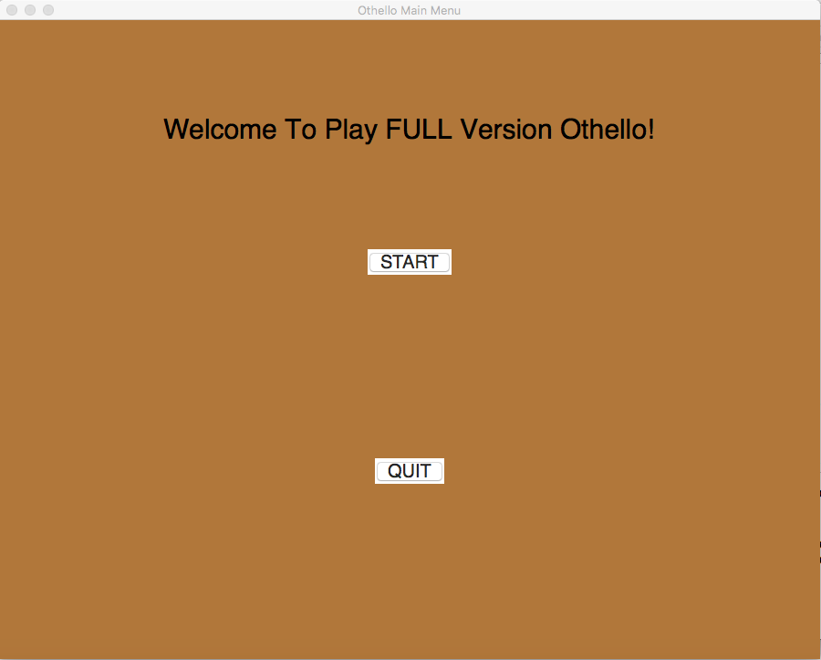
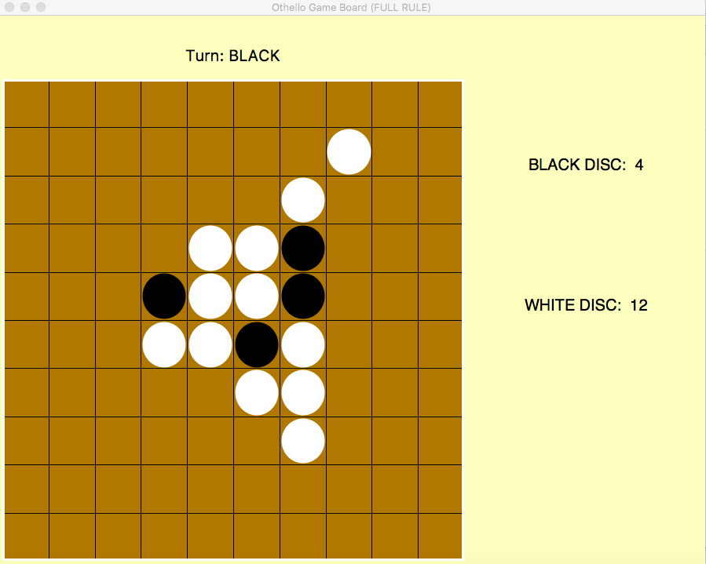

# Othello

## Implementation

A Python program implements the logic and GUI of the Othello game. The GUI is supported by the Tkinter package
in Python's standard library.

## Run
Clone the repository to local environment and install Python3 package.
```git clone https://github.com/dayuebai/Othello.git```

Run the command in command line: ```python3 othello_gui_main_window.py```

## Demo

* Menu


* Board

